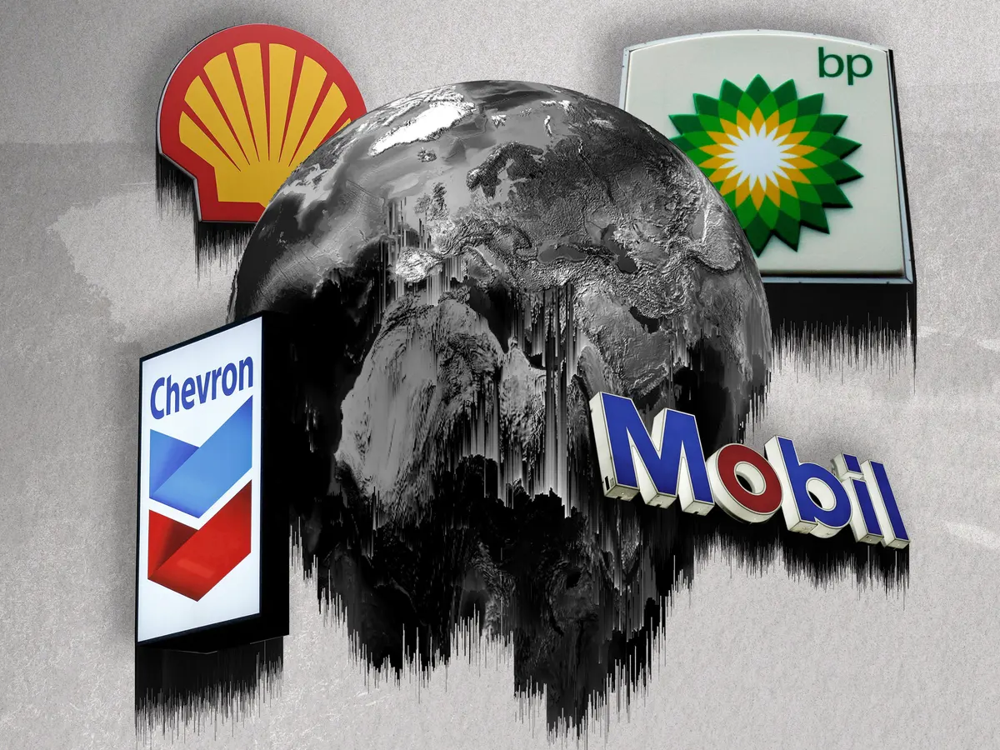

# CarbonBombs

*(Image source = <https://www.theguardian.com/environment/ng-interactive/2022/may/11/fossil-fuel-carbon-bombs-climate-breakdown-oil-gas>)*

425 fossil fuel projects around the world will generate more that 1 gigatonne of CO2 emissions during their lifetime.
<https://carbonbombs.webflow.io/> proposed a representation of those CarbonBombs and their link between Banks and Company that operate them.
This repository contains all informations needed to reproduce the data used on <https://carbonbombs.webflow.io/>

# Acronym used in this repository

- BOCC = Banking On Climate Chaos
- CB = Carbon Bombs (also corresponds to Carbon Bombs research paper)
- GEM = Global Energy Monitor

# Data sources

## Input data

Each md5sum associated to source data has been generated in md5sum_values. 
Files located in data_sources folder consitute the source data associated to the construction of our database :

- 1-s2.0-S0301421522001756-mmc2.xlsx : Data associated to research of Kühne and al. : Carbon Bombs - Mapping key fossil fuel projects that can be accessed at the following adress : <https://www.sciencedirect.com/science/article/pii/S0301421522001756>
- GROUP-Fossil_Fuel_Financing_by_Company_Banking_on_Climate_Chaos_2023.xlsx : Data containing banking transaction for the financement of Climate Bombs. Data can freely be download at <https://www.bankingonclimatechaos.org/>. The download link is the following (it might change over time): <https://www.bankingonclimatechaos.org/wp-content/themes/bocc-2021/inc/bcc-data-2023/GROUP-Fossil_Fuel_Financing_by_Company_Banking_on_Climate_Chaos_2023.xlsx>
- Global-Coal-Mine-Tracker-April-2023.xlsx : The Global Coal Mine Tracker (GCMT) is a worldwide dataset of coal mines and proposed projects. The tracker provides asset-level details on ownership structure, development stage and status, coal type, production, workforce size, reserves and resources, methane emissions, geolocation, and over 30 other categories. This data will not be tracked under this repository as it Distributed under a Creative Commons Attribution 4.0 International License. It can be freely download through this page : <https://globalenergymonitor.org/projects/global-coal-mine-tracker/download-data/>
- Global-Oil-and-Gas-Extraction-Tracker-Feb-2023.xlsx : The Global Oil and Gas Extraction Tracker (GOGET) is a global dataset of oil and gas resources and their development. GOGET includes information on discovered, in-development, and operating oil and gas units worldwide, including both conventional and unconventional assets. This data will not be tracked under this repository as it Distributed under a Creative Commons Attribution 4.0 International License. It can be freely download through this page : <https://globalenergymonitor.org/projects/global-oil-gas-extraction-tracker/>
- undata_*.csv : Statistical datasets downloaded from the UNSD databases website (<https://data.un.org/>)

## Output data

The files located in the "data_cleaned" folder constitute the database we use to construct the visualization tool available at <https://carbonbombs.webflow.io/>. The following files are included:

- bank_informations.csv: This file was generated through web scraping of <https://www.banktrack.org/>. More specifically, we retrieved information from all the banks listed at <https://www.banktrack.org/banks>, focusing on the "About" section (i.e., Website, Headquarters, CEO/Chair, Supervisor, Ownership).
  - Script that generated this file: scrapper.py
  - Source of the data: <https://www.banktrack.org/>
- carbon_bombs_informations.csv: This file contains information on Carbon Bombs extracted from two different data sources: the CB research paper and the GEM database. For some Carbon Bombs, we could not find data in the GEM database, so we generated it using ChatGPT. Please exercise caution when handling ChatGPT-generated data and refer to the section "Precautions when manipulating our data." The data source is specified in the column title when it is common to all columns (e.g., GEM). When data sources differ within a column, a "column1/column2_source" column provides details on the data source for each row. Please note that New_project column value is True for extraction site that haven't start production into 2020 (Source : CB research paper)
  - Script that generated this file: main.py
  - Source of the data:
    - Global-Coal-Mine-Tracker-April-2023.xlsx (Coal Mine)
    - Global-Oil-and-Gas-Extraction-Tracker-Feb-2023.xlsx (Oil & Gas Extraction site)
    - 1-s2.0-S0301421522001756-mmc2.xlsx (Carbon Bombs research paper)
    - Data_chatGPT_carbon_bombs.csv
- company_informations.csv: This file contains the approximative address, associated coordinates and the list of connected Carbon Bombs for each company. Approximative address has been generated with ChatGPT and verified manually.
  - Script that generated this file: scrapper.py
  - Source of the data: ./data_cleaned/Data_chatGPT_company_hq_adress.csv
- connexion_carbonbombs_company.csv : This file contains the connections between each company and various Carbon Bombs, along with the associated percentages. The file only includes three columns: Carbon_Bomb_Name, company, and percentage.
  - Script that generated this file: banking.py
  - Source of the data: ./data_cleaned/connexion_carbonbombs_company.csv
- connexion_bank_company.csv : This file contains information on the amount financed by each bank to companies involved in Carbon Bombs. It primarily consists of a filtered version of the BOCC database, including only companies present in the "Parent_company" field of the GEM database.
  - Script that generated this file: banking.py
  - Source of the data: GROUP-Fossil_Fuel_Financing_by_Company_Banking_on_Climate_Chaos_2023.xlsx
- country_informations.csv : This file contains the deduplicated list of countries where Carbon Bombs have been detected. It includes also additional statistical data of each country, extracted from the UN data website (<https://data.un.org/>)
  - Script that generated this file: countries.py
  - Source of the data:
    - carbon_bombs_informations.csv (created hereabove and located in the data_cleaned folder)
    - undata_*.csv
- carbon_bombs_all_datasets.xlsx : This file contains all previous files but stored into different tabs. Tabs name match the dataset name.

# Code Documentation

Code documentation has been generated using Sphinx Library.
To consult it, you can enter following command in your terminal : 
**open ./docs/_build/html/index.html** 
It will open documentation locally into your Web Browser.

## Update Sphinx documentation

When releasing the new version of a project please update Sphinx documentation with the following steps :

- 1: Naviguate into docs folder with the following command : cd ./docs
- 2 : Update release number of project with release variable of conf.py file
- 3 : Delete .rst file in order to ensure actualisation of the documentation with the following comand: rm -rf *.rst
- 3 : Update new .rst file with the following command : sphinx-apidoc -o . ..
- 4 : Update html documentation with the following command : make html (Do not take into account warning on modules.rst file)

# Precautions when manipulating our data

In this repository, our goal was to reconcile different data sources to establish a more comprehensive view of the organization around the exploitation of these carbon bombs. Some precautions regarding our data manipulation process are detailed below :

- To establish the link between the names of extractive companies used by BOCC and those used in the GEM database, some extractive companies had to be manually associated using the dictionaries presented in manual_match. Some errors or inaccuracies may be present in this manual association. We invite you to directly consult the manual_match file to observe the closeness in the connections we were able to establish. In case of an error, please contact the repository owner to submit a correction: <hellodataforgood@gmail.com>
- To establish the link between the names of Carbon Bombs by K.Kühne in his research paper and the names used in the GEM database, some Carbon Bombs had to be manually associated using the dictionaries presented in manual_match. Some errors or inaccuracies may be present in this manual association. We invite you to directly consult the manual_match file to observe the closeness in the connections we were able to establish. In case of an error, please contact the repository owner to make a correction: <hellodataforgood@gmail.com>
- In the GEM and CB research paper databases, the description of extraction sites is provided with different levels of granularity. This mainly concerns Gas & Oil carbon bombs, where in the CB research paper database, the information is presented at the level of a geological zone (Shale/OffShore/OnShore), while in the GEM database, the information remains presented at the level of each extraction site. A concrete example of this difference in granularity can be represented by the Carbon Bomb designated "Yucatan Platform Offshore" in the CB research paper, which consists of several extraction sites such as Akal, Nohoch, Chac, and Kutz, as described on the OnePetro oil company's website: <https://onepetro.org/OTCONF/proceedings-abstract/01OTC/All-01OTC/OTC-13177-MS/34073> 
In these cases, we have tried to gather the extraction sites within a geological area as much as possible (see manual_match dictionary where Extraction sites within a geological area are separated by "$"). It should be noted that, as with the previous point, some errors or inaccuracies may be present in this manual association. In case of an error, please contact the repository owner to make a correction: <hellodataforgood@gmail.com> 
It is also important to note that the Latitude and Longitude columns only contain the GPS coordinates of the first extraction site to simplify data extraction.
- The company shares are only indicative, taken from GEM, and should not be considered as an accurate breakdown of each company's share for two main reasons:
  - The updating of company share data may have changed over time. Some data on GEM indicates a sum of participation either greater or less than 100%.
  - When the share of companies exceeded 100%, we made an adjustment of the percentages to proportionally return to 100%. For example, Company 1 = 50%, Company 2 = 100% for the same carbon bomb, then we readjust to obtain Company 1 = 33.3%, Company 2 = 66.7%. This calculation is purely arbitrary and does not represent the actual share of companies in carbon bombs. For more accurate information without our readjustment calculations, we recommend referring directly to the GEM link provided for the Carbon Bomb in the carbon_bombs_informations.csv file.
- The data generated using ChatGPT contains a high degree of uncertainty, so it is crucial to take several precautions in order to ensure the integrity, reliability, and ethical use of the information produced :
  - Be aware that the AI's knowledge is limited to its training data, which may be outdated or incomplete.
  - Secondly, AI models can sometimes produce content that is biased, politically charged, or inappropriate. As stated on <https://chat.openai.com/>, ChatGPT may produce inaccurate information about people, places, or facts (ChatGPT Mar 23 Version).
- For the `Khafji` carbon bomb, [the ownership is splitted equally for both Kuwait and Saudi Arabia](https://www.sciencedirect.com/science/article/pii/S0301421522001756). Since we don't want to merge two countries and we don't want to duplicate the bomb, we'll attribute this carbon bomb to Kuwait to insure a better repartition (Kuwait has 3 bombs and Saudi Arabia 23).
- We added `EACOP` as a "Pipeline" Bomb_type. The net emission (0.379) is based [on this study](https://climateaccountability.org/wp-content/uploads/2022/10/CAI-EACOP-Rptlores-Oct22.pdf).
